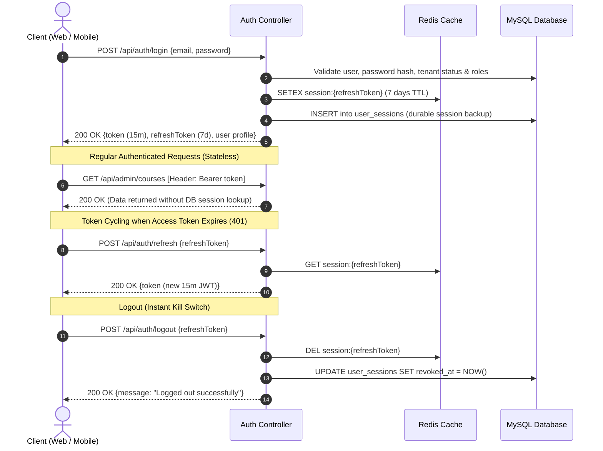

# VidyaSetu Multi-Tenant EdTech Platform — Comprehensive API Documentation

> **Version:** 2.0.0  
> **Environment:** Production / Staging / Local  
> **Base URL:** `http://localhost:5000` (or configured API domain)  
> **Documentation Scope:** Complete REST API catalog covering all user roles, authentication layers, multi-tenant isolation, request/response formats, parameters, and business logic.

---

## Table of Contents
1. [Architecture & Core Concepts](#1-architecture--core-concepts)
   - [1.1 Multi-Tenant Isolation](#11-multi-tenant-isolation)
   - [1.2 Authentication & Session Flow (JWT + Redis)](#12-authentication--session-flow-jwt--redis)
   - [1.3 User Types vs RBAC Permissions](#13-user-types-vs-rbac-permissions)
   - [1.4 Standard Response Envelope & Error Handling](#14-standard-response-envelope--error-handling)
   - [1.5 File Uploads & Document Storage](#15-file-uploads--document-storage)
2. [User Roles & Login Context Matrix](#2-user-roles--login-context-matrix)
3. [Complete API Reference by Module](#3-complete-api-reference-by-module)
   - [Module 1: Authentication & User Profile](#module-1-authentication--user-profile)
   - [Module 2: SaaS Super Admin — Multi-Tenant & Platform Management](#module-2-saas-super-admin--multi-tenant--platform-management)
   - [Module 3: SaaS Super Admin — Leads & Sales CRM](#module-3-saas-super-admin--leads--sales-crm)
   - [Module 4: SaaS Super Admin — Plans, Subscriptions & Billing](#module-4-saas-super-admin--plans-subscriptions--billing)
   - [Module 5: SaaS Super Admin — System Gateways & Notification Templates](#module-5-saas-super-admin--system-gateways--notification-templates)
   - [Module 6: SaaS Super Admin — Platform Settings, Users & RBAC Matrix](#module-6-saas-super-admin--platform-settings-users--rbac-matrix)
   - [Module 7: Institute Admin — Profile, Branches & Classrooms](#module-7-institute-admin--profile-branches--classrooms)
   - [Module 8: Academic Structure — Courses, Subjects, Bundles & Batches](#module-8-academic-structure--courses-subjects-bundles--batches)
   - [Module 9: Student Management & KYC Document Verification](#module-9-student-management--kyc-document-verification)
   - [Module 10: Staff & Faculty Directory](#module-10-staff--faculty-directory)
   - [Module 11: Front-Desk & Inquiries CRM (Admissions Funnel)](#module-11-front-desk--inquiries-crm-admissions-funnel)
   - [Module 12: Branch Finance, Fee Plans, Collections & Ledgers](#module-12-branch-finance-fee-plans-collections--ledgers)
   - [Module 13: Branch Accounting — Other Income, Expenses & Staff Payroll](#module-13-branch-accounting--other-income-expenses--staff-payroll)
   - [Module 14: Timetable Scheduling, Calendar & Conflict Resolution](#module-14-timetable-scheduling-calendar--conflict-resolution)
   - [Module 15: Faculty Lecture Change & Substitution Requests](#module-15-faculty-lecture-change--substitution-requests)
   - [Module 16: Daily Attendance Tracking & Bulk CSV Processing](#module-16-daily-attendance-tracking--bulk-csv-processing)
   - [Module 17: Homework, Assignments, Quizzes & Examinations](#module-17-homework-assignments-quizzes--examinations)
   - [Module 18: Teacher Portal — Schedule, Students & Grading](#module-18-teacher-portal--schedule-students--grading)
   - [Module 19: Student & Teacher Academic Doubt Resolution Forum](#module-19-student--teacher-academic-doubt-resolution-forum)
   - [Module 20: Support Ticketing System](#module-20-support-ticketing-system)
   - [Module 21: Analytics & Executive Dashboards](#module-21-analytics--executive-dashboards)
   - [Module 22: System Health & Key-Value Settings](#module-22-system-health--key-value-settings)
4. [Status Code & Error Reference](#4-status-code--error-reference)

---

## 1. Architecture & Core Concepts

### 1.1 Multi-Tenant Isolation
VidyaSetu is designed as a secure multi-tenant educational ERP. Every educational organization (Coaching Institute, Academy, School) operates as a separate **Tenant** identified by `tenant_id`.
- **Master Tenant (`tenant_id = 1`):** Reserved for SaaS Platform Administrators who oversee all institutes, subscription billing, leads, and global infrastructure.
- **Institute Tenants (`tenant_id >= 2`):** Isolated organizational databases/entities. All operational queries (students, staff, fees, attendance, timetable) are automatically scoped to the logged-in user's `tenant_id`.
- **Branch-Level Scoping:** Within a tenant, users assigned to a specific branch (`branch_id`) are constrained by middleware and services to only access records belonging to their authorized branch.

### 1.2 Authentication & Session Flow (JWT + Redis)
The platform uses enterprise-grade dual-token authentication:
1. **Access Token (JWT):** Short-lived (15 minutes). Sent in the `Authorization: Bearer <access_token>` header on every request. Validated statelessly via signature verification.
2. **Refresh Token (JWT):** Long-lived (7 days). Stored securely in Redis (`session:<refreshToken> -> userId`) and backed up durably in the MySQL `user_sessions` table.
3. **Session Cycling:** When an access token expires, the client calls `POST /api/auth/refresh` with the refresh token to obtain a fresh access token without re-prompting for credentials.
4. **Instant Invalidation (Logout):** Calling `POST /api/auth/logout` deletes the key from Redis and revokes the database record, terminating the session immediately.



### 1.3 User Types vs RBAC Permissions
The system differentiates between **High-Level Identity (`user_type`)** and **Granular Permissions (`user_roles` + `role_permissions`)**:
- **`user_type`** (`saas_admin`, `staff`, `student`, `parent`): Identifies the entity class, selects profile associations (`students`, `guardians`, `staff_profiles`), and directs the user to the appropriate UI layout.
- **`user_roles`**: Links users to one or more functional roles (e.g. `inst_admin`, `branch_admin`, `counsellor`, `finance`, `teacher`).
- **`role_permissions` & Overrides:** Dynamic permission codes (e.g., `course.create`, `fee.view`, `attendance.mark`) evaluated on every secured request by `requirePermission()`.

### 1.4 Standard Response Envelope & Error Handling
All API endpoints follow a uniform JSON structure:

#### Success Response
```json
{
  "status": "success",
  "message": "Operation completed successfully (optional)",
  "data": { ... },
  "pagination": {
    "total": 120,
    "page": 1,
    "limit": 10,
    "totalPages": 12
  }
}
```

#### Error Response
```json
{
  "status": "error",
  "message": "Human-readable description of error"
}
```

### 1.5 File Uploads & Document Storage
Upload endpoints use `multipart/form-data` with disk storage under `/uploads/` and static serving at `/uploads/<type>/<filename>`.
- **Supported types:** Institute logos (Max 500KB, PNG/JPG/WEBP), KYC documents (PDF/JPG/PNG up to 10MB), Homework/Assignment files (PDF/DOCX/Images up to 25MB), Support attachments (Up to 10MB), Doubt attachments (Up to 5 files, 10MB each), Attendance CSVs.

---

## 2. User Roles & Login Context Matrix

| Role Code | Primary User Type | Target Portal / UI | Typical Responsibilities & Scope |
|---|---|---|---|
| **`saas_admin`** | `saas_admin` | SaaS Admin Portal | Master platform control: onboard institutes (tenants), manage subscription plans, review platform revenue & invoices, track leads CRM, configure SMS/Email/WhatsApp gateways, manage global RBAC. |
| **`inst_admin`** | `staff` | Institute Admin Portal | Organization-wide administration: manage branches, academic courses, subjects, batches, classroom allocations, default fee plans, all staff and student directories, timetable templates, and institute analytics. |
| **`branch_admin`** | `staff` | Branch Admin Portal | Single branch operations: manage branch classrooms, assigned courses, branch student roster, branch fee collections, branch expenses, staff attendance, branch timetable, and daily operations. |
| **`finance`** | `staff` | Finance / Accounts Portal | Student fee collection, invoice/receipt generation, payment recording (Cash, UPI, Cheque, Bank Transfer), student ledger adjustments, non-fee income, operational expenses, staff salary structures & payroll disbursement. |
| **`counsellor`** | `staff` | Inquiries & Admissions CRM | Inbound inquiry management, lead qualification, scheduling demos, interaction history logs, follow-up reminders, and 1-click conversion of inquiries to enrolled students. |
| **`teacher`** | `staff` | Teacher / Faculty Portal | Daily & weekly lecture agenda, viewing assigned student roster, creating homework/assignments/exams, evaluation roster & bulk grading, answering student academic doubts with attachments, lecture reschedule requests, attendance marking. |
| **`student`** | `student` | Student Portal / Mobile App | View class schedule & timetable, access homework & assignments, submit solutions with attachments, view grades and teacher feedback, ask doubts to subject teachers with attachments, view attendance & fee status. |
| **`parent`** | `parent` | Parent Portal / App | Monitor ward's daily attendance, academic progress, homework completion, exam report cards, fee payment dues, and communication notices. |

---

## 3. Complete API Reference by Module

---

### Module 1: Authentication & User Profile

#### 1.1 User Login
- **Endpoint:** `POST /api/auth/login`
- **Auth Required:** None (Public)
- **What it does:** Authenticates user credentials, verifies account status and tenant activation, determines effective user role, generates Access Token (15m) and Refresh Token (7d), caches session in Redis and stores durable session in MySQL.
- **Why it is used:** Primary gateway for all web/mobile users to log into their respective portals.
- **Request Body:**
  ```json
  {
    "email": "admin@vidyasetu.com",
    "password": "Password123!"
  }
  ```
- **Response (200 OK):**
  ```json
  {
    "status": "success",
    "message": "Logged in successfully",
    "data": {
      "token": "eyJhbGciOiJIUzI1NiIsInR5cCI6IkpXVCJ9...",
      "refreshToken": "eyJhbGciOiJIUzI1NiIsInR5cCI6IkpXVCJ9...",
      "user": {
        "id": 1,
        "name": "Super Admin",
        "email": "admin@vidyasetu.com",
        "userType": "saas_admin",
        "tenantId": 1,
        "isSaasAdmin": true,
        "tenantName": null,
        "branch": null,
        "branchId": null,
        "branchCode": null,
        "mustChangePassword": false
      }
    }
  }
  ```

#### 1.2 Token Refresh
- **Endpoint:** `POST /api/auth/refresh`
- **Auth Required:** None (Requires valid refresh token)
- **What it does:** Verifies long-lived refresh token in Redis (or MySQL fallback) and issues a fresh 15-minute JWT access token without logging the user out.
- **Why it is used:** Silent background token renewal on frontend when HTTP 401 is intercepted.
- **Request Body:**
  ```json
  {
    "refreshToken": "eyJhbGciOiJIUzI1NiIsInR5cCI6IkpXVCJ9..."
  }
  ```
- **Response (200 OK):**
  ```json
  {
    "status": "success",
    "data": {
      "token": "eyJhbGciOiJIUzI1NiIsInR5cCI6IkpXVCJ9..."
    }
  }
  ```

#### 1.3 User Logout
- **Endpoint:** `POST /api/auth/logout`
- **Auth Required:** None (Passes refresh token in body)
- **What it does:** Immediately deletes the session key from Redis and marks the session row in MySQL as revoked.
- **Why it is used:** Terminates the user's active session and prevents token reuse.
- **Request Body:**
  ```json
  {
    "refreshToken": "eyJhbGciOiJIUzI1NiIsInR5cCI6IkpXVCJ9..."
  }
  ```
- **Response (200 OK):**
  ```json
  {
    "status": "success",
    "message": "Logged out successfully"
  }
  ```

#### 1.4 Update Profile
- **Endpoint:** `PUT /api/auth/profile`
- **Auth Required:** Bearer Token (`requireAuth`)
- **What it does:** Updates the logged-in user's name and email address after uniqueness checks.
- **Why it is used:** Allows users to manage their basic contact information.
- **Request Body:**
  ```json
  {
    "name": "Jane Doe",
    "email": "jane.doe@example.com"
  }
  ```
- **Response (200 OK):**
  ```json
  {
    "status": "success",
    "message": "Profile updated successfully"
  }
  ```

#### 1.5 Change Password
- **Endpoint:** `POST /api/auth/change-password`
- **Auth Required:** Bearer Token (`requireAuth`)
- **What it does:** Validates the existing password against the bcrypt hash in the database, then hashes and saves the new password.
- **Why it is used:** Enables secure self-service password updates.
- **Request Body:**
  ```json
  {
    "currentPassword": "OldPassword123!",
    "newPassword": "NewSecurePassword456!"
  }
  ```
- **Response (200 OK):**
  ```json
  {
    "status": "success",
    "message": "Password changed successfully"
  }
  ```

---

### Module 2: SaaS Super Admin — Multi-Tenant & Platform Management

*All endpoints in this module require `requireAuth` + `requireSaasAdmin`.*

#### 2.1 List All Tenant Institutes
- **Endpoint:** `GET /api/admin/tenants`
- **Permission:** `tenant.view`
- **What it does:** Returns a paginated list of all registered tenant institutes with status, active subscription plan, and usage stats.
- **Why it is used:** SaaS Admin dashboard for monitoring all customer coaching institutes.
- **Query Parameters:** `page` (int), `limit` (int), `search` (string), `status` (string/int), `plan` (int/string).
- **Response (200 OK):**
  ```json
  {
    "status": "success",
    "data": [
      {
        "id": 2,
        "name": "Apex IIT Academy",
        "slug": "apex-iit",
        "admin_email": "director@apexiit.com",
        "mobile": "9876543210",
        "city": "Kota",
        "state": "Rajasthan",
        "status": 1,
        "plan_name": "Enterprise Pro",
        "created_at": "2026-01-15T10:00:00.000Z"
      }
    ],
    "pagination": { "total": 45, "page": 1, "limit": 10 },
    "filters": { "statuses": [1, 2, 0, 3] }
  }
  ```

#### 2.2 Create / Onboard New Tenant Institute
- **Endpoint:** `POST /api/admin/tenants`
- **Permission:** `tenant.create`
- **Content-Type:** `multipart/form-data`
- **What it does:** Provisions a new coaching institute tenant, validates custom subdomain slug, creates initial primary branch, configures quota limits (branches, staff, students, storage), uploads institute logo, provisions initial admin user credentials, and starts the subscription billing cycle.
- **Why it is used:** Onboarding new institutes into the VidyaSetu SaaS ecosystem.
- **Form Fields:**
  - `name` (string, required): Institute name.
  - `slug` (string, required): Subdomain slug (e.g. `apex-academy`).
  - `adminEmail` (string, required): Institute owner's email.
  - `mobile` (string, required): 10-digit mobile number.
  - `planId` (number, required): Selected subscription plan ID.
  - `billingCycle` (string, required): `'monthly'` or `'yearly'`.
  - `address`, `city`, `state`, `pincode` (strings, required).
  - `panNo`, `gstNo`, `timezone` (strings, optional).
  - `maxBranches`, `maxStaffUsers`, `maxStudents`, `maxTeachers`, `maxStorage` (numbers, optional quotas).
  - `logo` (file, optional, max 500KB).
- **Response (201 Created):**
  ```json
  {
    "status": "success",
    "message": "Tenant created successfully",
    "data": { "tenantId": 3 }
  }
  ```

#### 2.3 Get Tenant Details by ID
- **Endpoint:** `GET /api/admin/tenants/:id`
- **Permission:** `tenant.view`
- **What it does:** Retrieves complete profile, address, quota limits, active plan, billing details, and stats for a specific tenant.
- **Why it is used:** Tenant detail view and audit in SaaS Admin.

#### 2.4 Update Tenant Institute
- **Endpoint:** `PUT /api/admin/tenants/:id`
- **Permission:** `tenant.update`
- **Content-Type:** `multipart/form-data`
- **What it does:** Updates tenant details, contact, addresses, quotas, and optional new logo.

#### 2.5 Change Tenant Status
- **Endpoint:** `PATCH /api/admin/tenants/:id/status`
- **Permission:** `tenant.update_status`
- **What it does:** Modifies tenant status (`1: Active`, `2: Pending Setup`, `0: Inactive/Suspended`, `3: Deleted`).
- **Why it is used:** Suspends non-paying institutes or activates verified accounts.
- **Request Body:**
  ```json
  {
    "status": 1
  }
  ```

---

### Module 3: SaaS Super Admin — Leads & Sales CRM

*All endpoints in this module require `requireAuth` + `requireSaasAdmin`.*

#### 3.1 List Prospective Leads
- **Endpoint:** `GET /api/admin/leads`
- **Permission:** `lead.view`
- **What it does:** Returns sales CRM leads with pipeline stage filtering, search, and pagination.
- **Why it is used:** Sales pipeline tracking for prospective institute signups.
- **Query Parameters:** `page`, `limit`, `search`, `status`, `source`.

#### 3.2 Get Single Lead with Follow-ups
- **Endpoint:** `GET /api/admin/leads/:id`
- **Permission:** `lead.view`
- **What it does:** Returns lead contact information along with the chronological history of follow-up interactions and reminders.

#### 3.3 Create New Lead
- **Endpoint:** `POST /api/admin/leads`
- **Permission:** `lead.create`
- **What it does:** Registers a new sales inquiry / lead in the platform CRM.
- **Request Body:**
  ```json
  {
    "name": "Dr. R. K. Sharma",
    "instituteName": "Sharma Physics Classes",
    "email": "sharma@example.com",
    "phone": "9876543210",
    "city": "Jaipur",
    "source": "Website",
    "notes": "Interested in 500 student plan."
  }
  ```

#### 3.4 Update Lead Details & Pipeline Status
- **Endpoint:** `PUT /api/admin/leads/:id` | `PATCH /api/admin/leads/:id/status`
- **Permission:** `lead.update`
- **What it does:** Modifies lead contact details or advances pipeline status (`New`, `Contacted`, `Demo Scheduled`, `Proposal Sent`, `Converted`, `Lost`).

#### 3.5 Delete Lead
- **Endpoint:** `DELETE /api/admin/leads/:id`
- **Permission:** `lead.delete`
- **What it does:** Soft-deletes a lead record from the CRM.

#### 3.6 Add Follow-up Note to Lead
- **Endpoint:** `POST /api/admin/leads/:id/followups`
- **Permission:** `lead_followup.add`
- **What it does:** Logs a phone call, email, or meeting note with next follow-up date and reminder.
- **Request Body:**
  ```json
  {
    "note": "Conducted Zoom demo. Director requested quote for 3 branches.",
    "nextFollowupDate": "2026-09-25T11:00:00.000Z"
  }
  ```

---

### Module 4: SaaS Super Admin — Plans, Subscriptions & Billing

*All endpoints in this module require `requireAuth` + `requireSaasAdmin`.*

#### 4.1 Subscription Plans Management (`/api/admin/plans`)
- `GET /api/admin/plans` (`plan.view`): List all subscription tiers (e.g. Starter, Growth, Enterprise).
- `GET /api/admin/plans/:id` (`plan.view`): Get plan feature matrix and pricing.
- `POST /api/admin/plans` (`plan.manage`): Create a new subscription tier with price, quotas, and feature flags.
- `PUT /api/admin/plans/:id` (`plan.manage`): Update plan pricing or quotas.
- `PUT /api/admin/plans/:id/visibility` (`plan.manage`): Toggle public visibility on the marketing website.
- `PATCH /api/admin/plans/:id/status` (`plan.manage`): Enable or disable plan.
- `DELETE /api/admin/plans/:id` (`plan.manage`): Delete plan tier.

#### 4.2 Subscriptions Management (`/api/admin/subscriptions`)
- `GET /api/admin/subscriptions` (`subscription.view`): List active and past institute subscriptions.
- `GET /api/admin/subscriptions/:id` (`subscription.view`): Get subscription validity, start date, expiry date, and renewal terms.
- `PATCH /api/admin/subscriptions/:id/plan` (`subscription.manage`): Upgrade or downgrade an institute's subscription plan.
- `PUT /api/admin/subscriptions/:id` (`subscription.manage`): Modify subscription dates or custom pricing terms.

#### 4.3 Platform Invoicing & Revenue Reports (`/api/admin/billing`)
- `GET /api/admin/billing/invoices` (`billing.view`): List all SaaS subscription invoices issued to institutes.
- `GET /api/admin/billing/invoices/:id` (`billing.view`): Get single SaaS invoice with GST breakdown and line items.
- `POST /api/admin/billing/invoices` (`billing.create`): Create manual subscription invoice for a tenant.
- `PUT /api/admin/billing/invoices/:id` (`billing.update`): Update platform invoice payment status (Paid, Unpaid, Void).
- `DELETE /api/admin/billing/invoices/:id` (`billing.delete`): Void invoice.
- `GET /api/admin/billing/summary` (`billing.view`): Platform-level billing metrics (Total Revenue, Monthly Recurring Revenue (MRR), Overdue Amount).
- `GET /api/admin/billing/revenue-trend` (`billing.view`): Historical monthly revenue trends.
- `GET /api/admin/billing/revenue-by-method` (`billing.view`): Revenue aggregated by payment method (Razorpay, Bank Transfer, Stripe).
- `GET /api/admin/billing/revenue-by-plan` (`billing.view`): Revenue aggregated by plan tier.

---

### Module 5: SaaS Super Admin — System Gateways & Notification Templates

*All endpoints in this module require `requireAuth` + `requireSaasAdmin`.*

#### 5.1 Communication Gateway Configurations (`/api/admin/system-configurations`)
- `GET /api/admin/system-configurations`: Get current gateway status for SMS, Email, and WhatsApp.
- `GET /api/admin/system-configurations/:channelType/providers`: Get supported providers for channel (`SMS`: Twilio, MSG91, Textlocal; `EMAIL`: SendGrid, AWS SES, SMTP; `WHATSAPP`: Gupshup, Twilio, Meta Cloud API).
- `GET /api/admin/system-configurations/:channelType`: Get credentials and configuration settings for channel.
- `PUT /api/admin/system-configurations/:channelType`: Upsert API keys, sender IDs, and gateway credentials.
- `PATCH /api/admin/system-configurations/:channelType/toggle`: Enable or disable the channel gateway across the platform.

#### 5.2 Notification Templates Management
- **Email Templates (`/api/admin/email-templates`):**
  - `GET /` (`email_template.view`): List email templates with category and trigger filters.
  - `GET /:id` (`email_template.view`): Get email template HTML body and variable placeholders (`{{student_name}}`, `{{fee_amount}}`, etc.).
  - `POST /` (`email_template.create`): Create email template.
  - `PUT /:id` (`email_template.update`): Update template subject and HTML content.
  - `PATCH /:id/status` (`email_template.update`): Toggle active status.
  - `DELETE /:id` (`email_template.update`): Delete template.
- **SMS Templates (`/api/admin/sms-templates`):** `GET /`, `GET /:id`, `POST /`, `PUT /:id`, `DELETE /:id`.
- **WhatsApp Templates (`/api/admin/whatsapp-templates`):** `GET /`, `GET /:id`, `POST /`, `PUT /:id`, `DELETE /:id`.

---

### Module 6: SaaS Super Admin — Platform Settings, Users & RBAC Matrix

*All endpoints in this module require `requireAuth` + `requireSaasAdmin` (except public role/permission helpers).*

#### 6.1 Platform Settings (`/api/admin/platform-settings`)
- `GET /api/admin/platform-settings`: Retrieve global platform settings.
- `GET /api/admin/platform-settings/:id`: Retrieve single setting.
- `POST /api/admin/platform-settings`: Create global setting.
- `PUT /api/admin/platform-settings/:id`: Update setting value.
- `DELETE /api/admin/platform-settings/:id`: Remove setting.

#### 6.2 System Users Management (`/api/admin/users`)
- `GET /api/admin/users/roles` (`user.view`): Meta list of available security roles for dropdowns.
- `GET /api/admin/users/tenants` (`user.view`): Meta list of all tenants for user assignment.
- `GET /api/admin/users` (`user.view`): List all users across the system with pagination, search, tenant, and role filters.
- `GET /api/admin/users/:id` (`user.view`): Get user details, assigned roles, and branch permissions.
- `GET /api/admin/users/:id/inherited-permissions` (`user.view`): Calculate and return the effective set of permissions inherited from roles + overrides.
- `POST /api/admin/users` (`user.create`): Create a new user with initial role assignment.
- `PUT /api/admin/users/:id` (`user.update`): Update user account info, name, email, or active status.
- `DELETE /api/admin/users/:id` (`user.delete`): Delete / deactivate user account.
- `POST /api/admin/users/:id/roles` (`user.update`): Assign a security role to a user.
- `PUT /api/admin/users/:id/roles/:roleId` (`user.update`): Update a user's role assignment.
- `DELETE /api/admin/users/:id/roles/:roleId` (`user.update`): Revoke a role from a user.
- `POST /api/admin/users/:id/overrides` (`user.update`): Add a custom permission override (explicit GRANT or DENY).
- `DELETE /api/admin/users/:id/overrides/:overrideId` (`user.update`): Remove a permission override.
- `POST /api/admin/users/:id/reset-password` (`user.update`): Force-reset a user's password.

#### 6.3 Security Roles & Permissions Matrix (`/api/admin/roles`)
- `GET /api/admin/roles/permissions`: Master list of all permission codes registered in the system.
- `GET /api/admin/roles`: List all system and tenant roles.
- `GET /api/admin/roles/:id`: Get role details and its assigned permission array.
- `POST /api/admin/roles` (`requireSaasAdmin`): Create custom RBAC role.
- `PUT /api/admin/roles/:id` (`requireSaasAdmin`): Update role permission associations.
- `DELETE /api/admin/roles/:id` (`requireSaasAdmin`): Delete custom role.

---

### Module 7: Institute Admin — Profile, Branches & Classrooms

*All endpoints in this module require `requireAuth` and are automatically scoped to the user's `tenant_id`.*

#### 7.1 Institute Profile (`/api/institute/profile`)
- **Endpoint:** `GET /api/institute/profile` | `PUT /api/institute/profile`
- **What it does:** Retrieves or updates the logged-in institute's organization details (Legal Name, Address, Contact Email, Phone, Currency, Academic Year start month, Logo).
- **Why it is used:** Allows Institute Admins to brand their portal, print receipts with their header, and set default regional preferences.

#### 7.2 Branches Management (`/api/admin/branches`)
- **Endpoint:** `GET /api/admin/branches` (`branch.view`)
- **What it does:** Lists all branches configured under the current institute with capacity, active student counts, and address.
- **Endpoint:** `POST /api/admin/branches` (`branch.create`)
- **What it does:** Creates a new branch (Name, Code e.g. `BR-MAIN`, Address, City, State, Capacity, Contact Person).
- **Endpoint:** `GET /api/admin/branches/:code` (`branch.view`)
- **What it does:** Retrieves branch details by code.
- **Endpoint:** `PUT /api/admin/branches/:code` (`branch.update`)
- **What it does:** Updates branch details.
- **Endpoint:** `DELETE /api/admin/branches/:code` (`branch.delete`)
- **What it does:** Deletes/archives a branch.
- **Endpoint:** `GET /api/admin/branches/:branchId/courses` (`branch.view`)
- **What it does:** Lists academic courses and programs offered at a specific branch.
- **Endpoint:** `POST /api/admin/branches/:branchId/courses/batch-assign` (`branch.update`)
- **What it does:** Assigns multiple courses to a branch in a single operation.
- **Endpoint:** `POST /api/admin/branches/:branchId/courses/:courseId/assign` | `unassign` (`branch.update`)
- **What it does:** Assigns or unassigns an individual course to/from a branch.
- **Endpoint:** `POST /api/admin/branches/:branchId/programs/:programId/toggle` (`branch.update`)
- **What it does:** Enables or disables an individual program under a branch.

#### 7.3 Classrooms Management (`/api/admin/classrooms` & `/api/admin/branches/:branchId/classrooms`)
- **Endpoints:**
  - `GET /api/admin/classrooms` / `GET /api/admin/branches/:branchId/classrooms` (`classroom.view`): List classrooms.
  - `POST /api/admin/classrooms` / `POST /api/admin/branches/:branchId/classrooms` (`classroom.create`): Create classroom (Name, Room Number, Capacity, AC/Projector/Lab facilities).
  - `GET /api/admin/classrooms/:id` (`classroom.view`): Get classroom details.
  - `PUT /api/admin/classrooms/:id` / `PATCH /:id` (`classroom.update`): Update classroom.
  - `PATCH /api/admin/classrooms/:id/status` (`classroom.update`): Toggle status (`active`, `inactive`, `maintenance`).
  - `DELETE /api/admin/classrooms/:id` (`classroom.delete`): Delete classroom.

---

### Module 8: Academic Structure — Courses, Subjects, Bundles & Batches

#### 8.1 Courses & Academic Programs (`/api/admin/courses`)
- `GET /api/admin/courses` (`course.view`): Lists all courses (e.g. "IIT-JEE 2-Year Integrated", "NEET Repeater", "Class 10 Foundation") with nested programs and levels.
- `POST /api/admin/courses` (`course.create`): Creates a new course hierarchy with code, name, description, and academic stream.
- `GET /api/admin/courses/:code` (`course.view`): Get course structure by code.
- `PUT /api/admin/courses/:code` (`course.update`): Update course metadata and stream mappings.
- `DELETE /api/admin/courses/:code` (`course.delete`): Delete course.

#### 8.2 Master Subjects (`/api/admin/subjects`)
- `GET /api/admin/subjects` (`course.view`): Lists all subjects (Physics, Chemistry, Mathematics, Biology, English).
- `POST /api/admin/subjects` (`course.create`): Creates a new subject (Name, Code e.g. `PHY-11`, Subject Type: Theory/Practical).
- `GET /api/admin/subjects/:code` (`course.view`): Get subject details by code.
- `PUT /api/admin/subjects/:code` (`course.update`): Update subject details.
- `DELETE /api/admin/subjects/:code` (`course.delete`): Delete subject.

#### 8.3 Custom Subject Bundles (`/api/admin/bundles`)
- `GET /api/admin/bundles` (`bundle.view`): Lists multi-subject bundles (e.g. PCM Bundle, PCB Bundle).
- `POST /api/admin/bundles` (`bundle.create`): Creates a subject bundle with mapped subjects, level, and bundle discount price.
- `GET /api/admin/bundles/:id` (`bundle.view`): Get bundle details and subject list.
- `PUT /api/admin/bundles/:id` (`bundle.update`): Update bundle subjects and pricing.
- `DELETE /api/admin/bundles/:id` (`bundle.delete`): Delete bundle.

#### 8.4 Batches Management (`/api/admin/batches`)
- `GET /api/admin/batches/academic-years` (`batch.view`): Lists available academic years (e.g. 2025-2026, 2026-2027).
- `GET /api/admin/batches` (`batch.view`): Lists batches with filters for branch, course, academic year, and status.
- `POST /api/admin/batches` (`batch.create`): Creates a new batch (Name e.g. "JEE 2026 Batch A", Code, Branch ID, Program ID, Max Capacity, Start Date, End Date).
- `GET /api/admin/batches/:id` (`batch.view`): Get batch details, enrolled student count, and timetable schedule.
- `PUT /api/admin/batches/:id` (`batch.update`): Update batch information.
- `PATCH /api/admin/batches/:id/status` (`batch.update`): Toggle batch status (`Active`, `Completed`, `Upcoming`).
- `DELETE /api/admin/batches/:id` (`batch.delete`): Delete batch.

#### 8.5 Institute Default Fee Plans (`/api/admin/fee-plans`)
- `GET /api/admin/fee-plans` (`fee.view`): Lists program-wise base fee structures.
- `GET /api/admin/fee-plans/levels/:levelId/subjects` (`fee.view`): Subject fees mapped for level.
- `PUT /api/admin/fee-plans/subject-fees` (`fee.update`): Upsert standalone subject fee.
- `PUT /api/admin/fee-plans/:id` (`fee.update`): Upsert program-level fee plan (Base Tuition, Admission Fee, Exam Fee, Installment counts, GST rate).
- `DELETE /api/admin/fee-plans/:id` (`fee.delete`): Clear program fee plan.

---

### Module 9: Student Management & KYC Document Verification

*Mounted at both `/api/admin/students` (Institute-wide) and `/api/branch/students` (Branch-scoped).*

#### 9.1 Academic Options Dropdown
- **Endpoint:** `GET /api/admin/students/options/academic` | `GET /api/branch/students/options/academic`
- **What it does:** Returns dropdown data for branches, batches, courses, programs, and academic years.

#### 9.2 List Students
- **Endpoint:** `GET /api/admin/students` | `GET /api/branch/students`
- **What it does:** Returns paginated student records with full search, branch filter, batch filter, academic year filter, and fee status filter (`PAID`, `PARTIAL`, `UNPAID`, `OVERDUE`).
- **Query Parameters:** `page`, `limit`, `search`, `branchId`, `batchId`, `courseId`, `status`, `feeStatus`.

#### 9.3 Register New Student
- **Endpoint:** `POST /api/admin/students` | `POST /api/branch/students`
- **What it does:** Onboards a new student, generates Student Code/Roll No, saves personal details, address, parent/guardian contact, assigns branch, batch, and course, and optionally creates user login credentials.
- **Request Body:**
  ```json
  {
    "firstName": "Rahul",
    "lastName": "Verma",
    "email": "rahul.verma@example.com",
    "phone": "9812345678",
    "dob": "2008-05-14",
    "gender": "Male",
    "address": "123 Civil Lines",
    "city": "Jaipur",
    "state": "Rajasthan",
    "pincode": "302001",
    "branchId": 1,
    "batchId": 4,
    "courseId": 2,
    "programId": 2,
    "guardianName": "Suresh Verma",
    "guardianPhone": "9812345679",
    "guardianRelation": "Father"
  }
  ```

#### 9.4 Get Student 360° Profile
- **Endpoint:** `GET /api/admin/students/:id` | `GET /api/branch/students/:id`
- **What it does:** Retrieves complete student record including personal info, guardians, enrolled batch, attendance summary, fee ledger, and uploaded documents.

#### 9.5 Update & Delete Student
- **Endpoint:** `PUT /api/admin/students/:id` | `PATCH /:id` | `DELETE /:id`
- **What it does:** Updates student information or soft-deletes the student record.

#### 9.6 Upload & Verify Student KYC Documents
- **Upload Document:** `POST /api/admin/students/upload-document` (`multipart/form-data` with file field `document`, `studentId`, `documentType`: Aadhaar, Marksheet, Photo).
- **Get Documents:** `GET /api/admin/students/:id/documents`.
- **Update Verification Status:** `PUT /api/admin/students/:id/documents/:docId/status` (`status`: `VERIFIED`, `REJECTED`, `PENDING`).

---

### Module 10: Staff & Faculty Directory

*Mounted at `/api/admin/staff` and `/api/branch/staff`.*

#### 10.1 List Staff Members
- **Endpoint:** `GET /api/admin/staff` | `GET /api/branch/staff`
- **What it does:** Lists staff members (Teachers, Counsellors, Accountants, Branch Admins) with role, branch assignment, designation, phone, and active status.

#### 10.2 Create Staff Member
- **Endpoint:** `POST /api/admin/staff` | `POST /api/branch/staff`
- **What it does:** Creates staff profile, assigns security role and branch, configures salary type (Monthly Fixed / Hourly), and provisions login credentials.
- **Request Body:**
  ```json
  {
    "name": "Prof. Amit Sharma",
    "email": "amit.sharma@institute.com",
    "phone": "9876501234",
    "roleId": 5,
    "branchId": 1,
    "designation": "Senior Physics Faculty",
    "salaryType": "MONTHLY",
    "basicSalary": 75000,
    "password": "TemporaryPassword123!"
  }
  ```

#### 10.3 Get, Update & Delete Staff
- **Endpoints:** `GET /:id`, `PUT /:id`, `DELETE /:id` for staff management.

---

### Module 11: Front-Desk & Inquiries CRM (Admissions Funnel)

*Mounted at `/api/admin/enquiries` and `/api/branch/enquiries`.*

#### 11.1 Inquiry Predefined Options
- **Endpoint:** `GET /api/admin/enquiries/options` (`enquiry:read`)
- **What it does:** Returns static metadata for statuses (`0: New Enquiry`, `1: Assigned`, `2: Contacted`, `3: Follow-up`, `4: Interested`, `5: Demo Scheduled`, `6: Fee Discussion`, `7: Converted`, `-1: Not Interested`, `-2: Cancelled`) and sources (`0: Walk-in`, `1: Phone Call`, `2: Website`, `3: Social Media`, `4: WhatsApp`, `5: Referral`, `6: Campaign`, `7: Google Ads`, `8: Other`).

#### 11.2 List Inquiries
- **Endpoint:** `GET /api/admin/enquiries` (`enquiry:read`)
- **What it does:** Returns filtered admissions inquiry pipeline with search, status, source, branch, course, and assigned counsellor.

#### 11.3 Create New Inquiry
- **Endpoint:** `POST /api/admin/enquiries` (`enquiry:create`)
- **What it does:** Captures walk-in or online prospective student lead.
- **Request Body:**
  ```json
  {
    "studentName": "Ananya Gupta",
    "parentName": "Vikram Gupta",
    "phone": "9823456789",
    "email": "ananya.gupta@example.com",
    "branchId": 1,
    "courseId": 2,
    "programId": 2,
    "source": 0,
    "counsellorId": 12,
    "remarks": "Looking for weekend batch."
  }
  ```

#### 11.4 Get & Update Inquiry
- **Endpoints:** `GET /:id` (`enquiry:read`), `PUT /:id` (`enquiry:update`).

#### 11.5 Log Inquiry Follow-up
- **Endpoint:** `POST /api/admin/enquiries/:id/followups` (`enquiry:followup`)
- **What it does:** Logs counsellor interaction note, updates inquiry status, and schedules the next follow-up reminder.
- **Request Body:**
  ```json
  {
    "status": 5,
    "note": "Attended trial physics class. Very positive feedback.",
    "nextFollowupDate": "2026-09-22T15:00:00.000Z"
  }
  ```

#### 11.6 Convert Inquiry to Enrolled Student
- **Endpoint:** `POST /api/admin/enquiries/:id/convert` (`enquiry:convert`)
- **What it does:** Automatically transitions the inquiry to status `7 (Converted)` and creates a registered student record in the target branch and batch with 1 click.
- **Request Body:**
  ```json
  {
    "batchId": 4,
    "rollNo": "JEE-2026-089",
    "admissionDate": "2026-09-18"
  }
  ```

---

### Module 12: Branch Finance, Fee Plans, Collections & Ledgers

*Mounted at `/api/branch/fees`, `/api/branch/finance`, and `/api/admin/payments`.*

#### 12.1 Branch Fee Configuration (`/api/branch/fees`)
- `GET /api/branch/fees/programs` (`fee.view`): Branch-specific full course program fee structures.
- `GET /api/branch/fees/levels/:levelId/subjects` (`fee.view`): Subject fees mapped to level for branch.
- `GET /api/branch/fees/bundles` (`fee.view`): Available subject bundles.
- `GET /api/branch/fees/collections` (`fee.view`): Student fee collection register.

#### 12.2 Student Fee Assignment (`/api/branch/fees/students/:studentId/fee-assignment`)
- `GET /api/branch/fees/students/:studentId/fee-assignment` (`fee.view`): Retrieves student's current assigned fee plan, concessions/discounts, installment schedule, and remaining balance.
- `PUT /api/branch/fees/students/:studentId/fee-assignment` (`fee.update`): Customizes student's fee plan (sets total fee, discount amount, discount reason, and installment due dates).

#### 12.3 Student Financial Ledger
- **Endpoint:** `GET /api/branch/finance/students/:studentId/ledger` (`fee.view`)
- **What it does:** Returns the complete financial history for a student: total expected fees, discounts applied, net payable, total collected, overdue balance, and list of all receipt invoices with payment modes.

#### 12.4 Collect Student Fee Payment (Invoice Generation)
- **Endpoint:** `POST /api/branch/finance/students/:studentId/payments` | `POST /api/branch/finance/payments`
- **Permission:** `fee.create`
- **What it does:** Records a fee installment payment (Cash, UPI, Cheque, Bank Transfer, Card), generates a formal receipt invoice with receipt number, recalculates remaining dues, and marks installment status (`PAID` or `PARTIAL`).
- **Request Body:**
  ```json
  {
    "amountPaid": 25000,
    "paymentMode": "UPI",
    "transactionRef": "UPI/20260918/987654321",
    "paymentDate": "2026-09-18",
    "remarks": "First installment payment for JEE 2026 Batch A"
  }
  ```
- **Response (200 OK):**
  ```json
  {
    "status": "success",
    "message": "Payment recorded successfully",
    "data": {
      "invoiceId": 142,
      "receiptNumber": "REC-2026-00142",
      "amountPaid": 25000,
      "remainingBalance": 50000,
      "feeStatus": "PARTIAL"
    }
  }
  ```

#### 12.5 Invoice Management
- `GET /api/branch/fees/invoices/:id` (`fee.view`): Get invoice/receipt details for printing.
- `PUT /api/branch/finance/invoices/:invoiceId` (`fee.update`): Modify invoice details.
- `DELETE /api/branch/finance/invoices/:invoiceId` (`fee.delete`): Void/cancel payment invoice and revert balance.

---

### Module 13: Branch Accounting — Other Income, Expenses & Staff Payroll

*Mounted under `/api/branch/finance/...`.*

#### 13.1 Other Income (Non-Fee Revenue) (`/api/branch/finance/other-income`)
- `GET /` (`other_income.view`): Lists miscellaneous income entries (Study Material / Books Sales, Uniform Sales, Registration Fees, Hall Rental).
- `POST /` (`other_income.create`): Records other income entry (Category, Title, Amount, Payment Mode, Date, Invoice Ref).
- `GET /:id`, `PUT /:id`, `DELETE /:id`: Voucher operations.

#### 13.2 Other Expenses (Operational Expenses) (`/api/branch/finance/other-expenses`)
- `GET /` (`expense.view`): Lists operational expenses (Electricity, Internet, Branch Rent, Marketing/Printing, Supplies, Repairs).
- `POST /` (`expense.create`): Records operational expense voucher (Category, Description, Amount, Payment Mode, Vendor Name, Date).
- `GET /:id`, `PUT /:id`, `DELETE /:id`: Expense voucher operations.

#### 13.3 Staff Salary Structure Master (`/api/branch/finance/staff-salaries`)
- `GET /` (`finance.view`): Lists all branch staff members with designation, salary type (Fixed Monthly / Hourly / Per Lecture), basic salary, and effective date.
- `PUT /:staffId` (`finance.update`): Updates a staff member's basic monthly salary and effective date.
- `DELETE /:staffId/salary` (`finance.delete`): Resets staff salary configuration.

#### 13.4 Monthly Staff Payroll & Salary Disbursement (`/api/branch/finance/staff-salaries/status`)
- `GET /status` (`finance.view`): Returns monthly payroll status for all employees (filters: `month`, `year`) showing `PAID` vs `PENDING`, basic pay, allowances, deductions, net payable, and total salary disbursement KPI.
- `POST /:staffId/pay` (`finance.create`): Records salary payment disbursement for a staff member for a specific month/year.
  - **Request Body:**
    ```json
    {
      "month": 9,
      "year": 2026,
      "basicAmount": 75000,
      "allowances": 5000,
      "deductions": 2000,
      "netAmount": 78000,
      "paymentMode": "Bank Transfer",
      "transactionRef": "NEFT-HDFC-987654",
      "remarks": "September 2026 Salary"
    }
    ```
- `GET /:staffId/history` (`finance.view`): Retrieves past salary payment slips for a staff member.
- `GET /payments/:paymentId`, `PUT /payments/:paymentId`, `DELETE /payments/:paymentId`: Individual salary payment voucher operations.

---

### Module 14: Timetable Scheduling, Calendar & Conflict Resolution

*Mounted at `/api/admin/timetable` and `/api/branch/timetable`.*

#### 14.1 Dropdown Metadata & Filter Options
- **Endpoint:** `GET /api/admin/timetable/options` | `GET /api/branch/timetable/options`
- **What it does:** Returns branches, batches, classrooms, subjects, and available faculty members.

#### 14.2 Default Weekly Timetable Templates
- `GET /default/:batchId`: Retrieves the recurring default weekly timetable schedule (Mon-Sun) configured for a batch.
- `POST /default/:batchId`: Saves or updates the recurring weekly template.
- `POST /default/clone`: Clones the weekly template from one batch to another.

#### 14.3 Live Calendar Schedules & Operations
- `GET /weekly`: Retrieves scheduled lectures for a given date range (`fromDate`, `toDate`) with lecture status (`SCHEDULED`, `COMPLETED`, `CANCELLED`, `RESCHEDULED`), faculty details, and classroom assignments.
- `POST /weekly/apply-default`: Instantiates actual calendar lectures from the default template for a specified date range.
- `POST /weekly/replicate`: Copies a week's full schedule to future target weeks.
- `POST /validate-conflicts`: Validates potential scheduling collisions:
  - **Faculty Conflict:** Checks if teacher is already assigned to another lecture at the same time.
  - **Classroom Conflict:** Checks if classroom is already occupied.
  - **Batch Conflict:** Checks if batch has overlapping classes.

#### 14.4 Lecture Operations
- `POST /lectures`: Schedules an individual lecture.
- `PUT /lectures/:id`: Updates lecture time, classroom, assigned teacher, or topic.
- `POST /lectures/:id/cancel`: Cancels a lecture with a cancellation reason.
- `DELETE /lectures/:id`: Deletes lecture record.

---

### Module 15: Faculty Lecture Change & Substitution Requests

*Mounted at `/api/admin/lecture-requests`.*

#### 15.1 Status Counts Summary
- **Endpoint:** `GET /api/admin/lecture-requests/counts`
- **What it does:** Returns summary KPI counts for requests (`PENDING`, `APPROVED`, `REJECTED`, `APPLIED`).

#### 15.2 List & View Requests
- `GET /`: Lists lecture requests with status, teacher, branch, and request type filters (`CANCELLATION`, `RESCHEDULE`, `SUBSTITUTION`).
- `GET /:id`: Retrieves details of a specific request.

#### 15.3 Create Lecture Request
- **Endpoint:** `POST /api/admin/lecture-requests`
- **What it does:** Submitted by teachers or coordinators when a class needs to be rescheduled, substituted with another faculty, or cancelled due to leave.
- **Request Body:**
  ```json
  {
    "lectureId": 402,
    "requestType": "SUBSTITUTION",
    "proposedTeacherId": 14,
    "reason": "Attending medical appointment",
    "proposedDate": null,
    "proposedStartTime": null,
    "proposedEndTime": null
  }
  ```

#### 15.4 Approve, Reject & Apply Requests
- `PUT /:id/approve`: Admin approves the proposed change.
- `PUT /:id/reject`: Admin rejects the request with comments.
- `POST /:id/apply`: Automatically updates the live timetable and notifies students/teachers.

---

### Module 16: Daily Attendance Tracking & Bulk CSV Processing

*Mounted at `/api/admin/attendance` and `/api/branch/attendance`.*

#### 16.1 Daily Lecture Schedule for Attendance
- `GET /options` (`attendance.view`): Dropdown metadata.
- `GET /lectures/today` (`attendance.view`): Today's lectures for the logged-in teacher/branch.
- `GET /lectures/daily` (`attendance.view`): All lectures on a given date with attendance completion status.

#### 16.2 Student Attendance Roster & Marking
- `GET /roster/:lectureId` (`attendance.view`): Returns the student roster for a lecture with current attendance status (`PRESENT`, `ABSENT`, `LATE`, `EXCUSED`, `UNMARKED`).
- `POST /save/:lectureId` (`attendance.mark`): Saves a draft of student attendance.
- `POST /submit/:lectureId` (`attendance.mark`): Submits and locks the finalized attendance for the lecture.
  - **Request Body:**
    ```json
    {
      "attendance": [
        { "studentId": 101, "status": "PRESENT", "remarks": null },
        { "studentId": 102, "status": "ABSENT", "remarks": "Informed sick leave" },
        { "studentId": 103, "status": "LATE", "remarks": "Arrived 15 mins late" }
      ]
    }
    ```

#### 16.3 Bulk CSV Attendance
- `GET /template/:lectureId` (`attendance.mark`): Downloads pre-populated CSV template with student names and roll numbers.
- `POST /bulk-upload/:lectureId` (`attendance.mark`): Uploads marked CSV file (`uploadAttendanceCsv`) to mark class attendance in bulk.

#### 16.4 Attendance Reports
- `GET /report/batch/:batchId` (`attendance.view`): Batch-level attendance percentage report over a date range.
- `GET /report/student/:studentId` (`attendance.view`): Individual student attendance history and percentage.

#### 16.5 Staff Attendance
- `GET /staff` (`attendance.view`): Daily staff attendance sheet.
- `POST /staff/save` (`attendance.mark`): Marks staff daily attendance (Present, Half Day, Leave, Absent).
- `POST /staff/lecture/:lectureId` (`attendance.mark`): Marks teacher presence for a specific conducted lecture.

---

### Module 17: Homework, Assignments, Quizzes & Examinations

*Mounted at `/api/admin/homeworks` (Admin), `/api/branch/homeworks` (Branch), `/api/teacher/homeworks` (Teacher), and `/api/student/homework` (Student).*

#### 17.1 Teacher & Admin Assessment Management
- `GET /scoping` (`assignment.view`): Dropdown options for batches, subjects, and academic years.
- `GET /` (`assignment.view`): Lists assessments (Homework, Assignment, Quiz, Practice Test, Term Exam) with submission stats.
- `POST /` (`assignment.create`): Creates assessment with multi-file question sheet uploads (`uploadHomeworkFiles`), title, description, batch, subject, max marks, due date, and publication status.
- `GET /:id` (`assignment.view`): Get assessment details and attached files.
- `PUT /:id` (`assignment.update`): Update assessment details.
- `DELETE /:id` (`assignment.delete`): Delete assessment.
- `POST /:id/publish` (`assignment.update`): Publishes assessment to student portals.
- `POST /:id/close` (`assignment.update`): Closes submissions for assessment.

#### 17.2 Evaluation & Grading
- `GET /:id/roster` (`assignment.view`): Evaluation roster showing all batch students with submission status (`SUBMITTED`, `PENDING`, `GRADED`, `LATE`).
- `GET /:id/submissions` (`assignment.view`): Lists submitted student answer files.
- `PUT /:id/submissions/:submissionId/grade` (`assignment.grade`): Grades a single student submission (marks obtained, percentage, teacher feedback).
- `POST /:id/bulk-grade` (`assignment.grade`): Submits grades in bulk for the entire batch roster.
  - **Request Body:**
    ```json
    {
      "grades": [
        { "studentId": 101, "marksObtained": 45, "remarks": "Excellent work" },
        { "studentId": 102, "marksObtained": 38, "remarks": "Review kinematics derivations" }
      ]
    }
    ```

#### 17.3 Student Homework Operations (`/api/student/homework`)
- `GET /api/student/homework`: Lists all assessments assigned to the logged-in student with due dates, max marks, and submission status.
- `GET /api/student/homework/:id`: View assessment details, download teacher question papers, and view grades/feedback.
- `POST /api/student/homework/:id/submit`: Submits solution with multi-file uploads (`uploadSubmissionFiles`) and student remarks.

---

### Module 18: Teacher Portal — Schedule, Students & Grading

*Mounted under `/api/teacher/...`.*

#### 18.1 Teacher Operational Schedule (`/api/teacher/schedule`)
- `GET /options` (`timetable.view`): Scoped filter options.
- `GET /today` (`timetable.view`): Today's operational teaching agenda (classes, classroom room numbers, timings, conducted/pending status).
- `GET /week` (`timetable.view`): Full weekly teaching timetable.
- `GET /upcoming` (`timetable.view`): Upcoming tests, lectures, and academic milestones.
- `GET /academic-events` (`timetable.view`): Institutional holidays, exam dates, and events.
- `GET /changes` (`timetable.view`): Notifications of lecture substitutions and schedule adjustments.

#### 18.2 Teacher Student Roster & Academic Records (`/api/teacher/students`)
- `GET /options` (`student.view`): Filter options for teacher's batches.
- `GET /` (`student.view`): Lists students enrolled in batches assigned to this teacher.
- `GET /:id` (`student.view`): Student academic profile.
- `GET /:id/assignments` (`assignment.view`): Student's historical assessment submission record, marks, and performance trends.

---

### Module 19: Student & Teacher Academic Doubt Resolution Forum

*Mounted at `/api/student/doubts` and `/api/teacher/doubts`.*

#### 19.1 Student Doubt Endpoints (`/api/student/doubts`)
- `GET /teachers`: Lists eligible faculty members for the student's enrolled subjects.
- `GET /`: Lists all doubts asked by the student (filters: `OPEN`, `ANSWERED`, `RESOLVED`).
- `POST /`: Raises a new academic doubt with multi-attachment uploads (up to 5 images/PDFs, max 10MB each).
  - **Form Data:** `subjectId`, `teacherId`, `title`, `description`, `attachments` (files).
- `GET /:id`: Retrieves the full conversation thread with teacher replies and attachment download links.
- `POST /:id/replies`: Student sends a follow-up reply with optional file attachments.
- `PATCH /:id/status`: Student marks doubt as `RESOLVED` or reopens it.

#### 19.2 Teacher Doubt Endpoints (`/api/teacher/doubts`)
- `GET /`: Lists academic doubts assigned to this faculty member with status and priority indicators.
- `GET /:id`: Retrieves doubt details, student info, and previous messages.
- `POST /:id/replies`: Faculty posts explanation with optional diagrams or solution files.
- `PATCH /:id/status`: Updates doubt status (`ANSWERED`, `RESOLVED`).

---

### Module 20: Support Ticketing System

*Mounted at `/api/admin/support`, `/api/branch/support`, and `/api/institute/support`.*

#### 20.1 List & Filter Tickets
- **Endpoint:** `GET /api/admin/support` (`support.view`)
- **What it does:** Retrieves support tickets across institute/branch/platform with status (`OPEN`, `IN_PROGRESS`, `RESOLVED`, `CLOSED`), priority (`LOW`, `MEDIUM`, `HIGH`, `CRITICAL`), and category (`TECHNICAL`, `BILLING`, `ACADEMIC`, `FEATURE_REQUEST`).

#### 20.2 Get Ticket Conversation
- **Endpoint:** `GET /api/admin/support/:ticketNumber` (`support.view`)
- **What it does:** Retrieves full ticket thread, requester details, chronological replies, and file attachments.

#### 20.3 Create Support Ticket
- **Endpoint:** `POST /api/admin/support` (`support.create`)
- **Content-Type:** `multipart/form-data`
- **Form Fields:** `subject`, `description`, `category`, `priority`, `attachment` (file, max 10MB).

#### 20.4 Reply to Support Ticket
- **Endpoint:** `POST /api/admin/support/:ticketNumber/replies` (`support.reply`)
- **What it does:** Posts a response to the ticket thread with an optional attachment.

#### 20.5 Manage Ticket Status & Priority
- `PATCH /:ticketNumber` (`support.edit`): Update category or priority.
- `PATCH /:ticketNumber/resolve` (`support.resolve`): Marks ticket as resolved.
- `PATCH /:ticketNumber/status` (`support.resolve`): Updates status (`OPEN`, `IN_PROGRESS`, `RESOLVED`, `CLOSED`).
- `DELETE /:ticketNumber` (`support.delete`): Deletes/archives ticket.

---

### Module 21: Analytics & Executive Dashboards

*Mounted under `/api/admin/dashboard/...`.*

#### 21.1 Institute & Branch Executive Dashboard
- **Endpoint:** `GET /api/admin/dashboard/institute`
- **Auth Required:** `requireAuth`
- **What it does:** Generates comprehensive multi-dimensional metrics for Institute Owners and Branch Managers:
  - **Financial Summary:** Total Expected Revenue, Net Collected, Total Overdue, Defaulter Student Counts, and Collection Efficiency.
  - **Student Metrics:** Total Active Students, New Admissions this month, Inactive/Alumni counts.
  - **Academic Operations:** Total Batches, Active Courses, Today's Scheduled Lectures, Completed vs Cancelled classes.
  - **Attendance Analytics:** Institute-wide average student attendance percentage and staff attendance rate.
  - **Time Series Trends:** Fee collection timeline and student enrollment growth trend.
- **Query Parameters:** `branch_id` (int), `from` (YYYY-MM-DD), `to` (YYYY-MM-DD), `academic_year_id` (int).

#### 21.2 SaaS Admin Command Center Dashboard
- **Endpoint:** `GET /api/admin/dashboard/saas-stats`
- **Auth Required:** `requireAuth` + `requireSaasAdmin`
- **What it does:** Aggregates macro platform metrics:
  - **Platform MRR & ARR:** Monthly Recurring Revenue and Annualized Recurring Revenue.
  - **Tenant Growth:** Active Institutes, Onboarding/Pending Institutes, Suspended Accounts.
  - **Subscription Breakdown:** Tier distribution (Starter vs Pro vs Enterprise).
  - **Sales Funnel:** Lead conversion rate from CRM pipeline.
  - **Support SLA:** Open vs Resolved platform tickets and average response times.
  - **Recent Activity:** Recent platform subscription payments and newly registered institutes.

#### 21.3 SaaS Revenue Trend & Academic Years
- `GET /api/admin/dashboard/saas-revenue` (`requireSaasAdmin`): Monthly SaaS recurring revenue time series.
- `GET /api/admin/dashboard/academic-years`: List academic years for dashboard filter dropdowns.

---

### Module 22: System Health & Key-Value Settings

#### 22.1 Health Check
- **Endpoint:** `GET /health`
- **Auth Required:** None (Public)
- **Response (200 OK):**
  ```json
  {
    "status": "success",
    "message": "API is running smoothly"
  }
  ```

#### 22.2 General Key-Value Settings (`/api/admin/settings`)
- `GET /api/admin/settings/:category/:key`: Retrieves application setting.
- `PUT /api/admin/settings/:category/:key`: Updates application setting.

---

## 4. Status Code & Error Reference

| HTTP Status Code | Meaning | Common Scenario in VidyaSetu |
|---|---|---|
| **`200 OK`** | Request Successful | Data fetched, updated, or action completed. |
| **`201 Created`** | Resource Created | New tenant, student, lead, lecture, or payment invoice registered. |
| **`400 Bad Request`** | Validation Error | Missing required fields, invalid phone/email format, invalid slug, duplicate entry. |
| **`401 Unauthorized`** | Authentication Failure | Missing/expired JWT access token or invalid credentials. |
| **`403 Forbidden`** | Permission / Scope Denied | User lacks required RBAC permission or attempted to access data outside their authorized branch/tenant. |
| **`404 Not Found`** | Resource Not Found | Requested student, batch, lecture, invoice, or route does not exist. |
| **`409 Conflict`** | Resource Conflict | Duplicate email address or scheduling collision (classroom/faculty clash). |
| **`500 Internal Server Error`** | Server Error | Uncaught database exception or service crash. |

---
*End of VidyaSetu Comprehensive API Documentation.*
