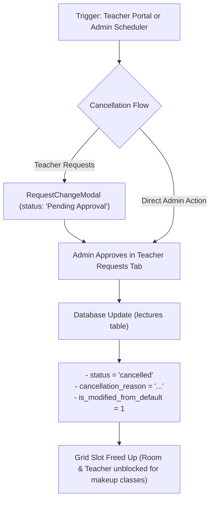
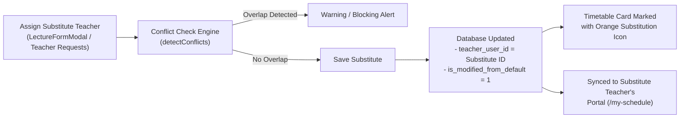

# VidyaSetu Timetable & Lecture Management: Cancellations and Substitutions Architecture

## 1. Overview & Unified Architecture

VidyaSetu uses a unified timetable architecture where the master recurring weekly template slots (`is_default = 1`) and actual date-specific calendar lectures (`is_default = 0`) are managed cleanly.

This document details the operational flow, database design, conflict prevention, and user experience for **Lecture Cancellations**, **Faculty Substitutions (Overrides)**, and **Teacher Schedule Change Requests**.

---

## 2. Lecture Cancellations Workflow

### Key Execution Steps:
1. **Initiation**:
   - **Faculty-Initiated**: Teacher accesses `/my-schedule`, selects a lecture, clicks *"Request Change"*, chooses *"Cancellation"*, and provides a mandatory reason.
   - **Admin-Initiated**: Admin clicks on any lecture slot in the Timetable Grid / Editor and selects *"Cancel Slot"*.
2. **Database State Changes**:
   - `status`: Updated to `'cancelled'`.
   - `cancellation_reason`: Populated with reason text (e.g., *"Faculty sick leave"*, *"Campus maintenance"*).
   - `is_modified_from_default`: Set to `1` (indicating deviation from the default recurring routine).
   - `updated_by`: Captures user ID of administrator or faculty.
3. **Calendar Effect**:
   - The slot is freed on the timetable grid, unblocking both the classroom and teacher for compensatory/makeup scheduling.

---

## 3. Substitute Teacher Assignments (Faculty Overrides)

### How Substitute Allocation Operates:
1. **Smart Faculty Filtering**:
   - When selecting a subject, the faculty dropdown highlights:
     - **Primary Teacher**: `Prof. Sharma (Assigned to Batch)` (via `teacher_allocations` & `teacher_subjects`).
     - **Qualified Substitutes**: `Prof. Gupta (Other Faculty)` (other faculty who teach this subject).
2. **Conflict & Workload Validation**:
   - Real-time engine verifies that the substitute is not double-booked at that date/time and does not exceed daily/weekly lecture limits.
3. **Visual Feedback in Timetable**:
   - The lecture card displays an orange **Substitution Icon (`Repeat`)** on `TimetableGrid`.
4. **Portal Reflection**:
   - The substitute faculty immediately sees the class on `/my-schedule`, while the original faculty's calendar is cleared for that slot.

---

## 4. Teacher-to-Batch & Subject Mapping Schema

1. **`teacher_subjects`**: Maps teachers to subjects they are qualified to teach.
2. **`teacher_allocations`**: Maps teachers to specific batches.
3. **`level_subjects`**: Maps subjects to program levels (e.g. Grade 11 JEE, Grade 12 NEET).

---

## 5. Summary of Key Database Columns (`lectures` Table)

| Field | Type | Description |
| :--- | :--- | :--- |
| `id` | INT AUTO_INCREMENT | Unique lecture identifier |
| `is_default` | TINYINT(1) | `1` = Master Template Slot; `0` = Concrete Calendar Lecture |
| `parent_template_id` | INT NULL | References `lectures(id)` of the master template rule |
| `batch_id` | INT | Target student batch |
| `subject_id` | INT | Subject taught |
| `teacher_user_id` | INT | Faculty assigned to teach on this specific date |
| `classroom_id` | INT NULL | Classroom assigned |
| `lecture_date` | DATE NULL | Specific calendar date (`NULL` for template slots) |
| `day_of_week` | TINYINT NULL | `1` (Mon) .. `7` (Sun) (populated for default templates) |
| `start_time` / `end_time` | TIME | Lecture timings |
| `status` | VARCHAR(30) | `'scheduled'`, `'in_progress'`, `'completed'`, `'cancelled'`, `'rescheduled'` |
| `is_modified_from_default` | TINYINT(1) | `1` if rescheduled, substitute assigned, or cancelled |
| `cancellation_reason` | TEXT NULL | Reason recorded if slot is cancelled |
